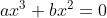
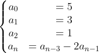
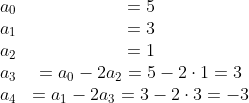

# Final test (variant 2)

Complete the tasks below. Commit and push changes to the generated repository.
You **don't** need to create a pull request.

> **NOTE**: To get the maximum grade, please implement the most efficient
solutions (in terms of execution time and memory used) in all coding tasks.

## 1. Code comprehension

Given a positive integer `n`, the program in the directory `all_factors` tries
to find all unique factors (both prime and non-prime) of `n`. The factors are
returned in a sorted slice.

For example, for `n = 6`, the program returns factors `[1 2 3 6]`.

However, the program doesn't work correctly for `n` that is a [perfect square](https://en.wikipedia.org/wiki/Square_number), e.g. for cases where `n` equals to `4`, `9`, `16`, etc.

Correct the bug and submit the code.

The program must work correctly for any positive integer `n`.

> **TIP**: Feel free to execute the program verifying the output for various
input `n`.

## 2. Equation (coding task)

Write a program that solves the equation  in real numbers.

1. Create the program in the directory `equation`.
1. Implement the logic in a function declared as
   `func equation(a, b float64) []float64`.
   * Input parameters `a` and `b` are coefficients in the above equation.
   * The returned value of type `[]float64` is a slice of all finite roots (in any order);
     `nil` if the equation doesn't have any roots or there are infinite number
     of real roots.
1. Implement `main()` function that
   1. reads `a` and `b` from the keyboard (`a` anb `b` are of type `float64`)
   1. calls `equation` function
   1. prints either
      1. all roots returned from the function,
      1. `No roots` if the equation doesn't have any roots,
      1. `All real numbers are roots` if all real number are the equation roots.
1. Create a file with tests for the program. The tests must cover all
   representative inputs.

### Example 1

```
The program solves the equation ax^3 + bx^2 = 0.
Enter a and b: 0 0
All real numbers are roots.
```
   
**Explanation**:

`equation(0, 0)` must return `nil`, because any real number is an equation root.

### Example 2

```
The program solves the equation ax^3 + bx^2 = 0.
Enter a and b: 2 -8
The roots are [0 4]
```

**Explanation**:

`equation(2, -8)` must return `[]float64{0, 4}` (`0`, `4` can
occur in any order). The roots of the equation `2x^3 - 8x^2 = 0` are `0` and
`4`.

## 3. Progression (coding task)

Write a program that finds the `n`th term (`n` is a non-negative integer) of
the progression

 

1. Create the program in the directory `progression`.
1. Implement the logic in a function declared as `func nthTerm(n uint) int`.
1. Implement `main()` function that
   1. reads `n` from the keyboard
   1. calls `nthTerm` function
   1. prints a value returned from the function.
1. Create a file with tests for the program. The tests must cover all
   representative inputs.

> **HINT**: Think about how many progression values you need to store at each
iteration.

### Example 1
   
```
Enter n: 1
The nth term is 3
```
   
**Explanation**:

`nthTerm(1)` must return `3`, because `a_1 = 3`.
 
### Example 2
 
```
Enter n: 4
The nth term is -3
```
    
`nthTerm(4)` must return `-3`, because



## itoa (coding task)

Write a program with a function `itoa(n int) string` that returns a string
representation of an integer `n`.

Solve this problem without using library functions (you may use `fmt` package for reading input and printing text).


1. Create the program in the directory `itoa`.
1. Implement the logic in a function declared as `func itoa(n int) string`.
1. Implement `main()` function that
   1. reads `n` from the keyboard
   1. calls `itoa` function
   1. prints a value returned from the function.
1. Create a file with tests for the program. The tests must cover all
   representative inputs.

### Example 1

```
The program tests the itoa function that returns a string representation of an integer.
Enter an integer: 123
The string representation: 123
```

### Example 2

```
The program tests the itoa function that returns a string representation of an integer.
Enter an integer: -123
The string representation: -123
```